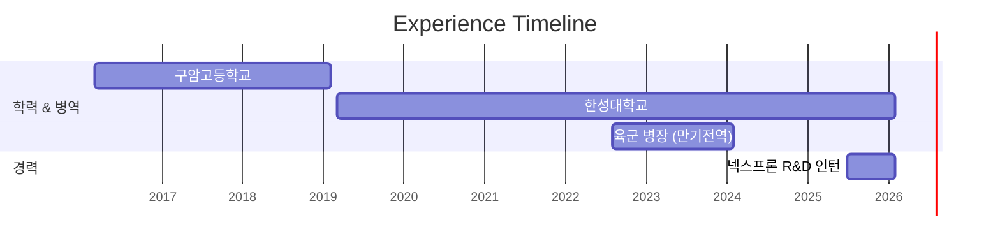

  <h2>👨‍💻 기능 구현을 넘어, 서비스의 구조와 성능을 함께 고민하는 백엔드 개발자 유현서입니다.</h2>

꾸준히 다져온 알고리즘 역량을 바탕으로, 효율적이고 안정적인 시스템을 구축하기 위해 노력하고 있습니다.

### 🗓 My Timeline

### 🛠 Tech Stack
- **Backend:**   
- **Database:**  
- **Infra & Auth:**  

### 🚀 Key Projects & Experience

**[넥스프론 R&D 인턴 (AICC 솔루션 인증/인가 모듈 설계)](https://github.com/vmffotltka/Identity-Modulith)**
- Keycloak을 도입하여 SAML 2.0 기반의 SSO 연동 환경 구축
- Fetch Join을 적용하여 권한 조회 과정의 N+1 문제 해결 및 단일 쿼리로 통합

**[길라의 빛 (병원 추천 시스템)](https://github.com/Capston-Design-Team-Nova/Light_Of_Gilla)**
- Amazon API Gateway를 도입하여 MSA 환경의 API 호출 엔드포인트 통합
- 원본 데이터(CSV)를 활용한 파이썬 자동화 스크립트로 5분 이내 DB 복구 파이프라인 구축

**[EduCraft (교육 보조 플랫폼)](https://github.com/vmffotltka/PreCapstone)**
- OpenAI API 연동을 통한 맞춤형 문제 생성 비동기 파이프라인 구축

### 🏆 Awards & Activities
- **교내 프로그래밍 경시대회(HSUPC) 대상(1위)** (2024.11)
  - 제한된 시간 내 최적의 알고리즘 구현을 위한 시간·공간 복잡도 검증 역량 입증
- **한성SW중심대학 페스티벌 코딩대회 우수상** (2024.11)
- **한성SW중심대학 페스티벌 공모전 우수상** (2024.11)

### 💎 Algorithm Profile

